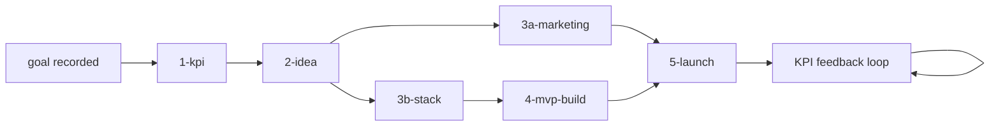

# Pipeline Specification (normative)

The authoritative phase state machine. CLAUDE.md summarizes this; when in doubt,
this file wins.

## State machine

## Resume contract

- `project/STATE.md` present → resume at its `Next action`. Absent → fresh start.
- A phase counts as done iff its exit artifact exists AND the STATE.md completion log
  marks it done. Done phases are never re-run; their artifacts are the source of truth.
- Re-entering a phase deliberately (e.g. KPI revision post-launch) is an explicit
  DECISIONS.md-logged action, not a re-run.

## Entry / exit criteria per phase

| Phase | Entry | Exit |
|-------|-------|------|
| 1-kpi | raw goal in STATE.md | KPI.md: 6 sections, nodes with units + in-product data sources, ≥2 guardrails |
| 2-idea | KPI.md complete | IDEA.md: ≥4 candidates from distinct perspectives, stated weights, winner with product-lens PASS |
| 3a-marketing | idea chosen | MARKETING/: positioning, landing-page, seo-plan, emails, social, README — all non-empty |
| 3b-stack | idea chosen | STACK.md written (platform + binding user constraints + stack); scaffold created (copied for web-Rust default, generated via ecosystem init tool otherwise); ecosystem check gate passes; build cache pre-warmed |
| 4-mvp-build | 3b done; MVP-SPEC.md filled | all slices pass their eval; `ecc:verification-loop` green; checkpoint per slice |
| 5-launch | 3a done AND 4 done | LAUNCH.md pre-launch items checked; gates concretized as STATE.md blockers; BACKLOG.md ≥5 items |

## Phase 4 execution paths

**Primary:** `/ecc:orch-build-mvp project/MVP-SPEC.md`
- Slices the spec into thin vertical slices, drives the GAN loop per slice, runs
  code review between slices.
- Its GATE 1 (slice-plan approval) and GATE 2 (commit) are **auto-approved** under
  this harness — they are not money/deploy/external-send gates.

**Fallback** (if orch-build-mvp stalls on an interactive prompt):
1. Slice MVP-SPEC.md manually (thin, vertical, ordered).
2. Per slice: `/ecc:gan-build "<slice brief>" --skip-planner` with `gan-harness/spec.md`
   pre-written from the slice.
3. After each slice: `ecc:verification-loop`, then `/ecc:checkpoint create <slice>`.

Env for both paths comes from `.env` (see `.env.example`): dev server command, port,
eval mode, pass threshold, max iterations.

**UI slices:** generator briefs must instruct loading `frontend-design` /
`frontend-ui-engineering` skills (if installed) before frontend work; absence is
noted in generator-state.md, and the evaluator scores Design/UX against the same
bar regardless.

## Gate behavior

When a hard gate (money / deploy / external-send) is hit:
1. Append the blocker to STATE.md "Blockers awaiting user" with what exactly is needed.
2. Continue every piece of non-blocked work in the current phase and any runnable
   parallel phase.
3. Only then stop and surface all pending gates to the user in one message.
